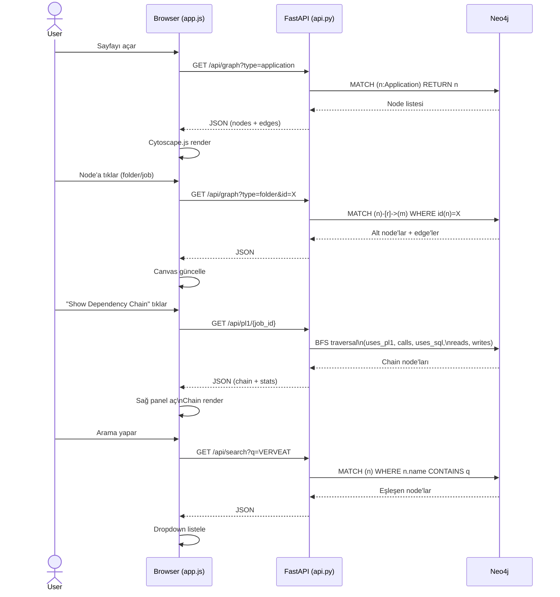

# API Flow

```mermaid
sequenceDiagram
    actor User
    participant UI as Browser (app.js)
    participant API as FastAPI (api.py)
    participant NEO as Neo4j

    User->>UI: Sayfayı açar
    UI->>API: GET /api/graph?type=application
    API->>NEO: MATCH (n:Application) RETURN n
    NEO-->>API: Node listesi
    API-->>UI: JSON (nodes + edges)
    UI->>UI: Cytoscape.js render

    User->>UI: Node'a tıklar (folder/job)
    UI->>API: GET /api/graph?type=folder&id=X
    API->>NEO: MATCH (n)-[r]->(m) WHERE id(n)=X
    NEO-->>API: Alt node'lar + edge'ler
    API-->>UI: JSON
    UI->>UI: Canvas güncelle

    User->>UI: "Show Dependency Chain" tıklar
    UI->>API: GET /api/pl1/{job_id}
    API->>NEO: BFS traversal\n(uses_pl1, calls, uses_sql,\nreads, writes)
    NEO-->>API: Chain node'ları
    API-->>UI: JSON (chain + stats)
    UI->>UI: Sağ panel aç\nChain render

    User->>UI: Arama yapar
    UI->>API: GET /api/search?q=VERVEAT
    API->>NEO: MATCH (n) WHERE n.name CONTAINS q
    NEO-->>API: Eşleşen node'lar
    API-->>UI: JSON
    UI->>UI: Dropdown listele
```