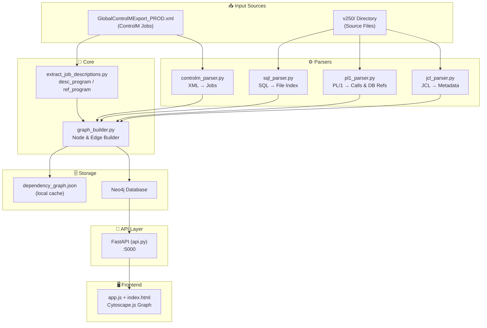

# Architecture Overview

```mermaid
graph TB
    subgraph Input["📥 Input Sources"]
        XML["GlobalControlMExport_PROD.xml<br/>(ControlM Jobs)"]
        V250["v250/ Directory<br/>(Source Files)"]
    end

    subgraph Parsers["⚙️ Parsers"]
        CP["controlm_parser.py<br/>XML → Jobs"]
        JP["jcl_parser.py<br/>JCL → Metadata"]
        P1P["pl1_parser.py<br/>PL/1 → Calls & DB Refs"]
        SP["sql_parser.py<br/>SQL → File Index"]
    end

    subgraph Core["🧠 Core"]
        EJD["extract_job_descriptions.py<br/>desc_program / ref_program"]
        GB["graph_builder.py<br/>Node & Edge Builder"]
    end

    subgraph Storage["🗄️ Storage"]
        NEO["Neo4j Database"]
        JSON["dependency_graph.json<br/>(local cache)"]
    end

    subgraph API["🚀 API Layer"]
        FAST["FastAPI (api.py)<br/>:5000"]
    end

    subgraph UI["🖥️ Frontend"]
        APP["app.js + index.html<br/>Cytoscape.js Graph"]
    end

    XML --> CP
    XML --> EJD
    V250 --> JP
    V250 --> P1P
    V250 --> SP

    CP --> GB
    EJD --> GB
    JP --> GB
    P1P --> GB
    SP --> GB

    GB --> NEO
    GB --> JSON

    NEO --> FAST
    FAST --> APP
```