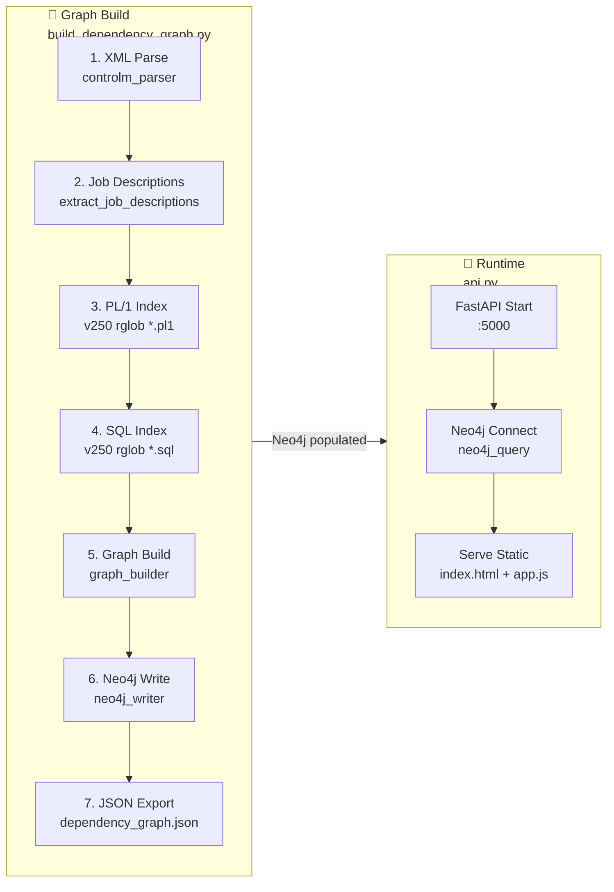

# Build & Deployment Pipeline

```mermaid
flowchart LR
    subgraph Build["🔨 Graph Build\nbuild_dependency_graph.py"]
        S1["1. XML Parse\ncontrolm_parser"] --> S2
        S2["2. Job Descriptions\nextract_job_descriptions"] --> S3
        S3["3. PL/1 Index\nv250 rglob *.pl1"] --> S4
        S4["4. SQL Index\nv250 rglob *.sql"] --> S5
        S5["5. Graph Build\ngraph_builder"] --> S6
        S6["6. Neo4j Write\nneo4j_writer"] --> S7
        S7["7. JSON Export\ndependency_graph.json"]
    end

    subgraph Run["🚀 Runtime\napi.py"]
        R1["FastAPI Start\n:5000"] --> R2
        R2["Neo4j Connect\nneo4j_query"] --> R3
        R3["Serve Static\nindex.html + app.js"]
    end

    Build -->|"Neo4j populated"| Run
```