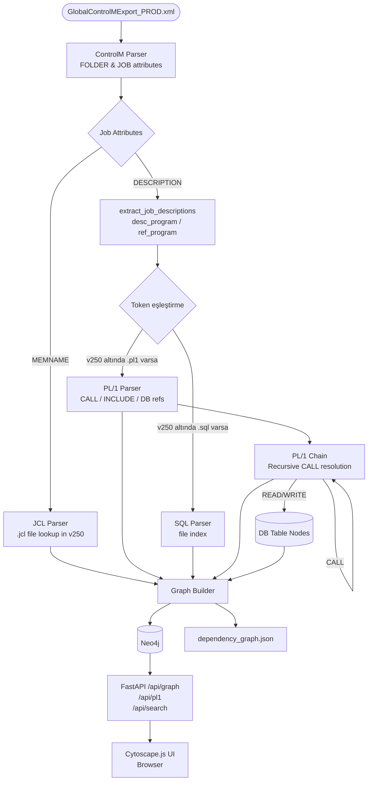

# Data Flow

```mermaid
flowchart TD
    A([GlobalControlMExport_PROD.xml]) --> B[ControlM Parser\nFOLDER & JOB attributes]

    B --> C{Job Attributes}
    C --> |MEMNAME| D[JCL Parser\n.jcl file lookup in v250]
    C --> |DESCRIPTION| E[extract_job_descriptions\ndesc_program / ref_program]

    E --> F{Token eşleştirme}
    F --> |v250 altında .pl1 varsa| G[PL/1 Parser\nCALL / INCLUDE / DB refs]
    F --> |v250 altında .sql varsa| H[SQL Parser\nfile index]

    G --> I[PL/1 Chain\nRecursive CALL resolution]
    I --> |CALL| I
    I --> |READ/WRITE| J[(DB Table Nodes)]

    D --> K[Graph Builder]
    G --> K
    H --> K
    I --> K
    J --> K

    K --> L[(Neo4j)]
    K --> M[dependency_graph.json]

    L --> N[FastAPI /api/graph\n/api/pl1\n/api/search]
    N --> O[Cytoscape.js UI\nBrowser]
```