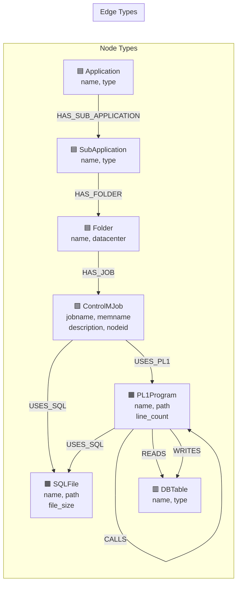

# Neo4j Graph Schema

```mermaid
graph LR
    subgraph Nodes["Node Types"]
        APP["🟦 Application\nname, type"]
        SUB["🟦 SubApplication\nname, type"]
        FOL["🟦 Folder\nname, datacenter"]
        JOB["🟩 ControlMJob\njobname, memname\ndescription, nodeid"]
        PL1["🟧 PL1Program\nname, path\nline_count"]
        SQL["🟫 SQLFile\nname, path\nfile_size"]
        DB["🟥 DBTable\nname, type"]
    end

    subgraph Edges["Edge Types"]
        APP -->|"HAS_SUB_APPLICATION"| SUB
        SUB -->|"HAS_FOLDER"| FOL
        FOL -->|"HAS_JOB"| JOB
        JOB -->|"USES_PL1"| PL1
        JOB -->|"USES_SQL"| SQL
        PL1 -->|"CALLS"| PL1
        PL1 -->|"READS"| DB
        PL1 -->|"WRITES"| DB
        PL1 -->|"USES_SQL"| SQL
    end
```